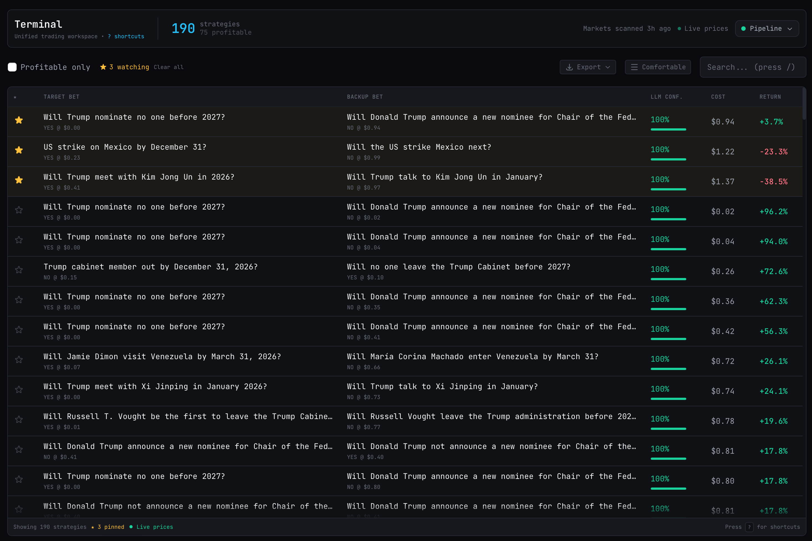

<p>
 <h3 align="center">Chainstack is the leading suite of services connecting developers with Web3 infrastructure</h3>
</p>

<p align="center">
  • <a target="_blank" href="https://chainstack.com/">Homepage</a> •
  <a target="_blank" href="https://chainstack.com/protocols/">Supported protocols</a> •
  <a target="_blank" href="https://chainstack.com/blog/">Chainstack blog</a> •
  <a target="_blank" href="https://docs.chainstack.com/quickstart/">Blockchain API reference</a> • <br> 
  • <a target="_blank" href="https://console.chainstack.com/user/account/create">Start for free</a> •
</p>


# Alphapoly - Polymarket alpha detection platform

Find covering portfolios across correlated prediction markets using predefined rules and LLM decisions. The system detects relationships between markets, classifies them to identify hedging pairs, and tracks their prices. The platform offers a smooth UI for entering detected pairs when profit opportunities exist and tracking your positions.

OpenRouter is the primary LLM API for this app (see `.env.example`). The starter defaults to the OpenRouter free router for both implication extraction and validation, and you can override either model in the UI or `.env`.




## How It Works

1. **Groups** - Fetches multi-outcome markets from Polymarket (e.g., "Presidential Election Winner")
2. **Implications** *(LLM)* - Extracts logical relationships between groups
3. **Validation** *(LLM)* - Validates implications at the individual market level
4. **Portfolios** - Computes cost and expected profit for validated pairs using live market prices
5. **Positions** - Tracks your purchased position pairs

## Prerequisites

- [uv](https://docs.astral.sh/uv/) (manages Python automatically)
- **Node.js 18+** via [fnm](https://github.com/Schniz/fnm), nvm, or brew

## Quick Start

```bash
cp .env.example .env

# With make
make install && make dev

# Without make
cd backend && uv sync
cd frontend && npm install
cd backend && uv run python -m uvicorn server.main:app --port 8000 &
cd frontend && npm run dev
```

Dashboard: http://localhost:3000 · API: http://localhost:8000/docs

## Commands

**With make** (auto-detects fnm/nvm/volta):
```bash
make install    # Install deps
make dev        # Start both servers
make pipeline   # Run ML pipeline (incremental, also available in UI)
make lint       # Auto-fix: ruff + prettier + eslint
```

**Without make**:
```bash
# Backend
cd backend && uv sync
cd backend && uv run python -m uvicorn server.main:app --reload --port 8000

# Frontend
cd frontend && npm install
cd frontend && npm run dev
```

## Agentic Coding

This repo is configured for AI coding agents via the `.claude/` directory:

- **`CLAUDE.md`** — project context, commands, conventions, and API routes
- **`hooks/`** — auto-lint on edit, guard against writing secrets *(Claude Code only)*
- **`skills/`** — workflows for pipeline management, trading, and feature development

### Skills

The `.claude/skills/` directory contains [Agent Skills](https://agentskills.io/home) — an open standard for extending AI coding agents with reusable, modular capabilities. Each skill is a directory with a `SKILL.md` file (YAML frontmatter + natural-language instructions) that teaches an agent how to perform a domain-specific workflow.

| Skill | Purpose |
|-------|---------|
| `alphapoly-pipeline` | Run, debug, and manage the ML pipeline |
| `alphapoly-portfolios` | Fetch and display portfolio opportunities |
| `alphapoly-enter-position` | Execute a covered pair trade |
| `alphapoly-exit-position` | Exit or manage an open position |
| `alphapoly-feature` | Add features following stack conventions |
| `alphapoly-experiment` | Scaffold standalone experiment scripts |

**Cross-agent portability.** The Agent Skills format was [originated by Anthropic](https://www.anthropic.com/engineering/equipping-agents-for-the-real-world-with-agent-skills) and released as an open standard. It has since been adopted by [OpenAI Codex](https://developers.openai.com/codex/skills/), [GitHub Copilot](https://code.visualstudio.com/docs/copilot/customization/custom-instructions), [Cursor](https://cursor.com/docs/context/rules), Google Antigravity, and [many others](https://github.com/skillmatic-ai/awesome-agent-skills). Skills are filesystem-based (not API-based), so any agent that can read a directory and parse Markdown can consume them — a skill authored for one agent typically runs unchanged in another.

To use the skills in this repo with a different agent, point it at `.claude/skills/` or copy the skill directories into the agent's expected location (e.g., `~/.codex/skills/` for Codex CLI).

### Instructions file

`CLAUDE.md` is read natively by [Claude Code](https://docs.anthropic.com/en/docs/claude-code) and by [GitHub Copilot in VS Code](https://code.visualstudio.com/docs/copilot/customization/custom-instructions#_use-a-claudemd-file) (opt-in via `chat.useClaudeMdFile`). For broader cross-agent compatibility, [`AGENTS.md`](https://agents.md/) is also provided as a symlink to `CLAUDE.md` — an open format (stewarded by the [Linux Foundation](https://www.linuxfoundation.org/)) supported by Codex, Cursor, Copilot, and others.

## Experiments

| Folder | Description |
|--------|-------------|
| [`experiments/onchain-otc/`](experiments/onchain-otc/) | On-chain OTC trading without the CLOB — split/merge, P2P transfers, atomic escrow, NegRisk conversions, and intent-based settlement on an Anvil fork of Polygon |

---

**Disclaimer:** This software is provided as-is for educational and research purposes only. It is not financial advice. Trading prediction markets involves risk—you may lose money. Use at your own discretion.
